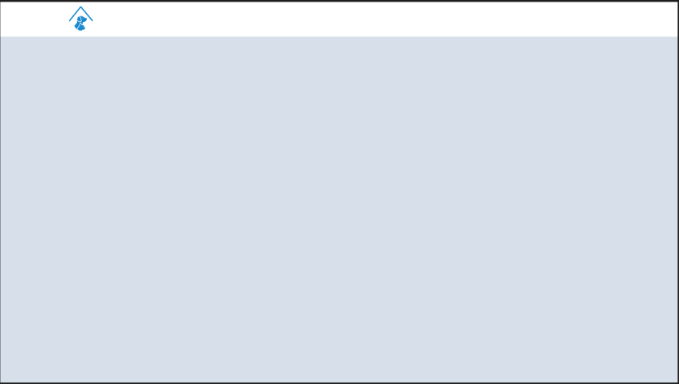
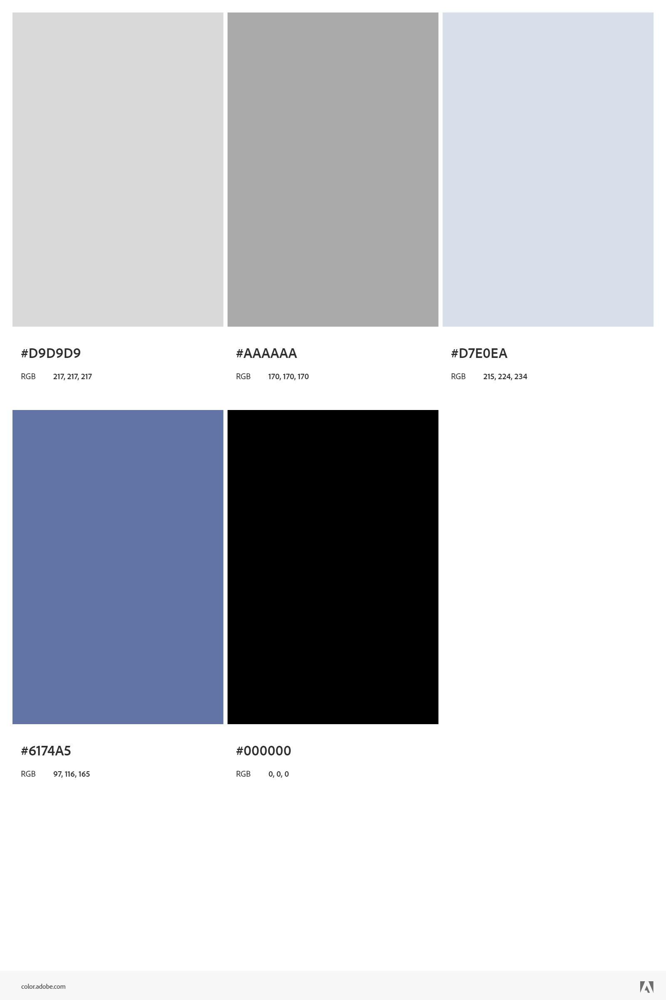

# Template padrão do site

Layout padrão do site (HTML e CSS) que será utilizado em todas as páginas com a definição de identidade visual, aspectos de responsividade e iconografia.

HTML

<body>
        <!-- CABEÇALHO -->
    

       

            <button>
            
            </button>
        

    

   <!-- MATCHES -->
    

</body>

CSS

body {
    margin: 0;
    padding: 0;
    font-family: Arial, sans-serif;
    overflow: hidden;
  }
  
  /* Cabeçalho */
  .header {
    position: absolute;
    width: 100%;
    height: 65px;
    background-color: #fff;
    z-index: 1;
  }
  
  /* Background azul da página geral */
  .background {
    position: absolute;
    top: 0;
    left: 0;
    width: 100%;
    height: 100%;
    display: flex;
    justify-content: center;
    align-items: center;
    text-align: center;
    background-color: #D7E0EA;
    background-size: 100% 100%;
    background-repeat: no-repeat;
    z-index: -1;
  }

  /* Botão da Logo */
  .home > button {
    margin-left: 20px;
    padding: 0%;
    width: 55px;
    height: 65px;
    border: none;
    background: transparent;
}

Explique as guias de estilo utilizadas no seu projeto.

## Design

Detalhe os layouts que serão utilizados. Apresente onde será colocado o logo do sistema. Defina os menus padrões, entre outras coisas.

## Cores

## Tipografia

Roboto: 
Apresente as fontes que serão utilizadas e sua função no site. As principais funções são: Título de página, Título de Seção, Rótulos de componentes e Corpo de Texto.

## Iconografia
Abrir arquivo

Definir foto de perfil

Redirecionar para outra página

Redirecionar para o chat

Abrir configurações

Botões de match

Setas retorno e enviar

Apresente os estilos CSS criados para cada um dos elementos apresentados.
Outras seções podem ser adicionadas neste documento para apresentar padrões de componentes, de menus, etc.

> **Links Úteis**:
>
> -  [Como criar um guia de estilo de design da Web](https://edrodrigues.com.br/blog/como-criar-um-guia-de-estilo-de-design-da-web/#)
> - [CSS Website Layout (W3Schools)](https://www.w3schools.com/css/css_website_layout.asp)
> - [Website Page Layouts](http://www.cellbiol.com/bioinformatics_web_development/chapter-3-your-first-web-page-learning-html-and-css/website-page-layouts/)
> - [Perfect Liquid Layout](https://matthewjamestaylor.com/perfect-liquid-layouts)
> - [How and Why Icons Improve Your Web Design](https://usabilla.com/blog/how-and-why-icons-improve-you-web-design/)
